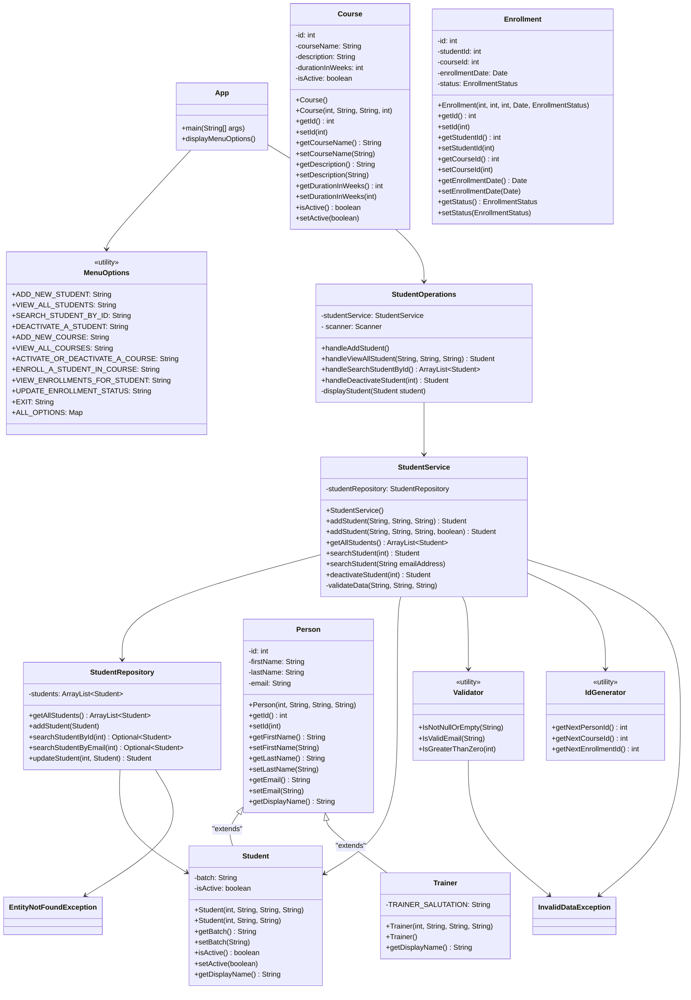

# Learntrack 

LearnTrack is a console-based Student & Course Management System built using Core Java.
It will allow admins to manage:

- Students
- Courses
- Enrollments

LearnTrack is a Java console application built with [Apache Maven](https://maven.apache.org/).

## Prerequisites
Before you begin, ensure you have the following installed on your system:
* **Java Development Kit (JDK)**: Version 17 or higher
* **Apache Maven**: Version 3.9.0 or higher [Setup Guide](https://maven.apache.org/install.html) OR `choco install maven`

## Steps to run the app:

Clone the app locally and run following commands in the terminal,

```bash
mvn clean package -DskipTests

java -cp target/learntrack-1.0-SNAPSHOT.jar com.airtribe.App
```

Class Diagram: 



*Note - Course and Enrollment related classes are not added in the class diagram as they follow the same pattern.*